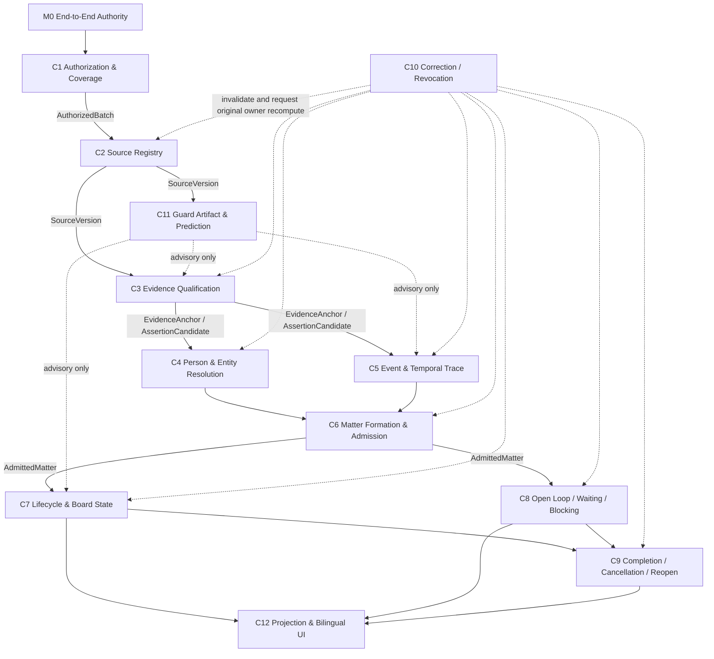

# Matters FlowGuard ModelMesh

This is a human-readable projection of the executable hierarchy in
`flowguard_models/model_mesh.py`. It does not replace the native FlowGuard
receipt.

M0 owns only orchestration receipt state. Each child owns exactly its declared
canonical fields and side effects. Every output token is producer-qualified in
the executable mesh, so identical display labels from different children
cannot conceal an unconsumed producer.

`mesh_green` is bounded to model partition, abstract and known-bad evidence,
current evidence reattachment, output consumption, join reachability, and
terminal closure. It is not production, live-provider, conformance, or UI
runtime evidence.

All G3 evidence is generated and consumed inside one local Python process.
There is therefore no process boundary requiring a portable-model refinement
binding at this gate. Any later subprocess, plugin, or external verifier
boundary must add and validate a portable artifact before its evidence can be
consumed.
