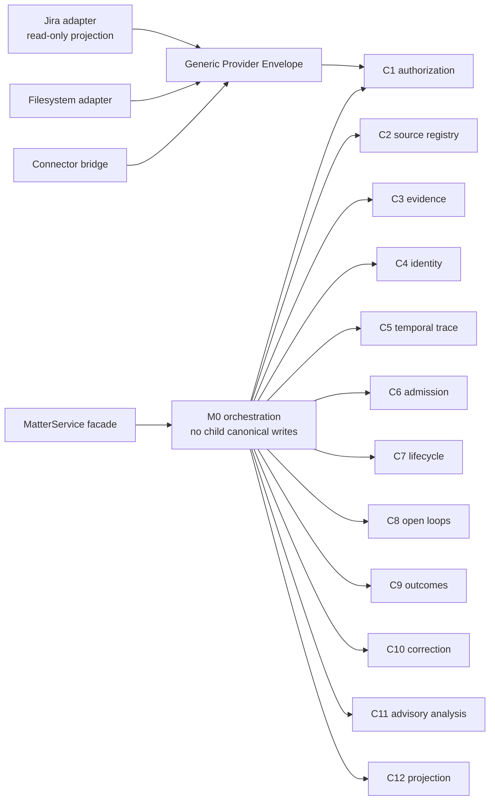

# Model-Derived Code Structure

G4 fixes one writer for every canonical field, state transition, and side
effect before production implementation begins. The executable source is
`flowguard_design/architecture.py`; the field-level projection is
`flowguard_design/field_lifecycle.py`.

The public `MatterService` is the only facade. It delegates to M0 and does not
form a second success path. M0 integrates current child receipts but cannot
write a child's canonical state. Each C1-C12 owner has one `CodeContract`.
Helper modules may calculate values or format projections, but have no
independent state authority.

The provider boundary is generic. Jira-specific values stay inside
`ExternalReference(provider="jira")`; `jira_issue_id` and `jira_status` are not
required canonical fields. Provider status is evidence input, never lifecycle
or completion authority.

## Module ownership

| Model | Primary module | Contract |
|---|---|---|
| M0 | `src/matters/application/orchestrator.py` | `CC-M0-orchestrator` |
| C1 | `src/matters/authorization/coverage.py` | `CC-C1-owner` |
| C2 | `src/matters/provenance/source_registry.py` | `CC-C2-owner` |
| C3 | `src/matters/provenance/evidence.py` | `CC-C3-owner` |
| C4 | `src/matters/identity/people.py` | `CC-C4-owner` |
| C5 | `src/matters/timeline/events.py` | `CC-C5-owner` |
| C6 | `src/matters/domain/admission.py` | `CC-C6-owner` |
| C7 | `src/matters/state/lifecycle.py` | `CC-C7-owner` |
| C8 | `src/matters/state/open_loops.py` | `CC-C8-owner` |
| C9 | `src/matters/state/outcomes.py` | `CC-C9-owner` |
| C10 | `src/matters/revisions/corrections.py` | `CC-C10-owner` |
| C11 | `src/matters/analysis/guard_bridge.py` | `CC-C11-owner` |
| C12 | `src/matters/presentation/projections.py` | `CC-C12-owner` |

G4's receipt proves the inventory and ownership design only. Runtime boundary
observations remain `not_run` until implementation and conformance phases.
