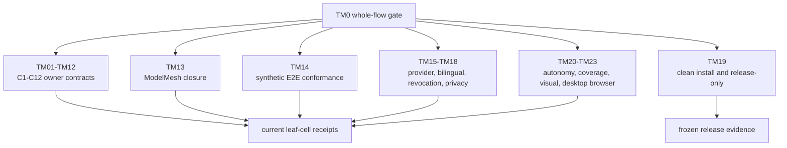

# TestMesh Design

TM0 is the whole-flow decision gate. TM01-TM23 are exact evidence owners, not
an unordered list of convenient commands. The executable inventory is
`flowguard_design/test_mesh.py`.

| Suite | Evidence owner |
|---|---|
| TM01-TM12 | One corresponding C1-C12 owner contract and its transition cells |
| TM13 | M0/C1-C12 reattachment and ModelMesh closure |
| TM14 | M0 synthetic end-to-end authority and cross-provider conformance |
| TM15 | Generic provider envelope pagination and retry |
| TM16 | English/zh-CN same-revision semantic equivalence |
| TM17 | Revocation, invalidation, and original-owner recompute |
| TM18 | External private roots and public-repository boundary |
| TM19 | Clean clone, install, release identity, and anonymous recheck |
| TM20 | Autonomous WorkPackageV2 analysis and original-owner dispatch |
| TM21 | Persistent object coverage, restart, and changed-only work |
| TM22 | Safe representative visual selection and correction |
| TM23 | Desktop bilingual object-browser behavior and geometry |

Every suite records owner, required cells, routine/release class, command,
planned/executed/failed/not-run counts, reason, exit code, terminal status,
result path, fingerprint, covered obligations, and freshness. The invariant is
`planned = executed + not_run` and `failed <= executed`.

At G4 all 23 suites are deliberately `not_run`. Native TestMesh therefore
blocks runtime confidence and final receipts. The separate G4 structural
decision is green only when every cell and inventory item has exactly one
planned owner and the only native findings are execution-evidence findings.
