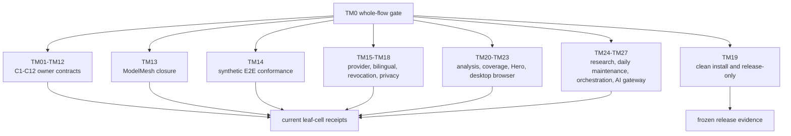

# TestMesh Design

TM0 is the whole-flow decision gate. TM01-TM27 are exact evidence owners, not
an unordered list of convenient commands. The executable inventory is
`flowguard_design/test_mesh.py`.

| Suite | Evidence owner |
|---|---|
| TM01-TM12 | One corresponding C1-C12 owner contract and its transition cells |
| TM13 | M0/C1-C12 reattachment and ModelMesh closure |
| TM14 | M0 synthetic end-to-end authority and cross-provider conformance |
| TM15 | Generic provider envelope pagination and retry |
| TM16 | English/zh-CN same-revision semantic equivalence |
| TM17 | Revocation, invalidation, and original-owner recompute |
| TM18 | External private roots and public-repository boundary |
| TM19 | Clean clone, install, release identity, and anonymous recheck |
| TM20 | Autonomous WorkPackageV2 analysis and original-owner dispatch |
| TM21 | Persistent object coverage, restart, and changed-only work |
| TM22 | Private generated-Hero states and Images-gallery separation |
| TM23 | Desktop bilingual object-browser behavior and geometry |
| TM24 | A1 ResearchOperation and exact ResearchGuard identity |
| TM25 | Daily Codex maintenance scheduling and safe idle/backoff |
| TM26 | A2 maintenance orchestration and bounded A0/A1 delegation |
| TM27 | A3 bounded model-map/context queries and append-only AI feedback |

Every suite records owner, required cells, routine/release class, command,
planned/executed/failed/not-run counts, reason, exit code, terminal status,
result path, fingerprint, covered obligations, and freshness. The invariant is
`planned = executed + not_run` and `failed <= executed`.

Every repository `tests/test_*.py` file is also an independent TestMesh
inventory item. It must be referenced by exactly one suite: an unowned file, a
missing referenced file, or a file listed under multiple suites blocks the
plan before execution.

The v10 parent-narrative inventory retains the v9 reconciliation/query-shape
obligations and adds the following exact
obligations without creating new semantic owners:

- TM01 consumes the tracked-only coverage-schema rebase and coverage-orphan
  retirement transition cells;
- TM02 consumes overlapping-root occurrence deduplication and one-current-plan
  evidence;
- TM05 and TM10 keep observation-time correction, ancestor/canonical
  propagation, and no-processing-time fallback distinct;
- TM06 consumes atomic parent composition plus singular append-only
  same-Matter canonicalization, including rollback and conflicting retry;
- TM12 consumes indexed filter/order/page selection followed by visible-id
  hydration through `tests/test_object_browser_catalog_query.py`.
- TM20 uniquely owns `tests/test_contract_rebase_and_global_recall.py`, binding
  bounded current-contract WorkPackage rebasing to autonomous dispatch and
  global reconciliation recall.
- TM05, TM06, and TM12 jointly cover the parent-narrative handoff: a material
  child clue queues refresh without changing activity authority; C6 binds the
  complete current child/projection/evidence scope; C12 publishes only the
  bilingual overview and cannot mutate title, lifecycle, activity order, or
  generated-hero identity.

At G4 all 27 suites are deliberately `not_run`. Native TestMesh therefore
blocks runtime confidence and final receipts. The separate G4 structural
decision is green only when every cell and inventory item has exactly one
planned owner and the only native findings are execution-evidence findings.
